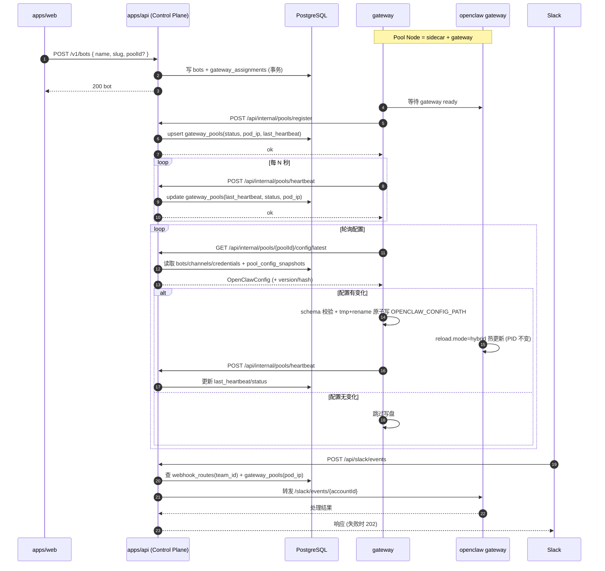

# OpenClaw Gateway Pool 实施设计

## Context

Gateway Pool 在本文中指一个独立的运行节点（更接近分布式架构中的 Node，而非传统资源池语义）。

每个 Gateway Pool Node 独立运行一个 OpenClaw Gateway 实例。

- 不引入独立的中心化管理服务。
- 每个 Gateway Pool Node 运行：
  - `openclaw gateway` 主进程
  - `gateway` 辅助进程（负责配置拉取、落盘、热更新、运行状态上报）
- 控制面继续由 `apps/api` 承担（Bot/Channel/Credential/Config 生成）。

线上实际会部署多个 Gateway Pool Node，每个节点可承载多个 OpenClaw agents（来自多个 bot 的配置汇总）。

换句话说：**保留控制面 API，把运行时职责下沉到每个 Gateway Pool Node。**

---

## Goals

1. 建立可运行的 OpenClaw Runtime Sidecar 模式（每个 Pool Node 自治）。
2. 保证配置严格兼容 `openclaw-config-schema`，支持热加载。
3. 降低系统复杂度：不做中心化 pool 调度、重平衡、迁移状态机。
4. 保留可观测性与安全基线（健康、日志脱敏、失败退避）。

## Non-Goals

- 不引入独立 `apps/runtime` 作为中心化管理组件（runtime 仅指 Pool Node 内 sidecar + gateway 运行单元）。
- 不实现跨 Pod 自动重平衡。
- 不实现复杂异步编排（队列、分布式锁、任务编排器）。
- 不修改 OpenClaw 核心源码。

---

## 架构总览

```text
apps/web
  -> apps/api (/v1/*)

apps/api (Control Plane)
  - Bot / Channel / Credential 管理
  - Runtime Config 生成与版本化
  - Webhook 入口与路由

apps/gateway-pool (N 个)
  - openclaw gateway 安装在本地/容器内
  - gateway
```

### 设计原则

- **控制面集中，运行面自治**：
  - API 只提供“期望配置”；
  - sidecar 负责“本地实际生效”。
- **每个 Pool Node 独立拉取配置**：失败只影响自身。
- **避免全局编排依赖**：不再依赖中心化 pool 协调服务才能运行。

---

## 运行模式

统一支持两种 OpenClaw 来源：

1. `local`（开发）
   - 使用本地 `OPENCLAW_DIR`。
2. `image`（部署）
   - 使用镜像内预装 OpenClaw。

推荐环境变量：

- `OPENCLAW_RUNTIME_SOURCE=local|image`
- `OPENCLAW_DIR`（local 必填）
- `OPENCLAW_BIN`（可选）
- `OPENCLAW_CONFIG_PATH`（sidecar 落盘配置路径）
- `OPENCLAW_STATE_DIR`（运行时状态目录）
- `RUNTIME_POOL_ID`（该 sidecar 所属 pool 节点标识）
- `INTERNAL_API_TOKEN`（sidecar 调用 internal HTTP API）
- `RUNTIME_API_BASE_URL`（默认 `http://localhost:3000`，指向 `apps/api`）

可选调优参数：

- `RUNTIME_POLL_INTERVAL_MS`
- `RUNTIME_POLL_JITTER_MS`
- `RUNTIME_MAX_BACKOFF_MS`
- `RUNTIME_REQUEST_TIMEOUT_MS`
- `RUNTIME_HEARTBEAT_INTERVAL_MS`

---

## 模块边界

### apps/api

- `routes/*`：Public API 的 HTTP 协议、OpenAPI、鉴权。
- `routes/pool-routes.ts`（新增 internal HTTP）：Pool Node 内部交互（register/heartbeat/config）。
- `lib/config-generator.ts`：纯函数，输入 bot/channel/credential，输出 OpenClaw config。
- `services/runtime/*`（新增）：
  - 配置快照发布
  - internal HTTP config 查询
  - runtime 实例状态记录（可选）

### gateway（Pool Node 内）

- 周期拉取控制面配置（HTTP query）
- 校验 schema
- 原子写入 `OPENCLAW_CONFIG_PATH`
- 触发/依赖 OpenClaw `reload.mode=hybrid` 热更新
- 上报心跳（可选但推荐）

### 控制面当前写入路径（基于现有代码）

- `apps/api/src/routes/bot-routes.ts`：创建 bot 时会 `findOrCreateDefaultPool()`，必要时写入 `gateway_pools` 默认记录，并把 `bots.pool_id` 绑定到该 pool。
- `apps/api/src/routes/channel-routes.ts`：Slack 连接成功后写入 `webhook_routes(pool_id, external_id, bot_channel_id)`。
- `apps/api/src/routes/pool-routes.ts`：通过内部 HTTP 端点提供 register/heartbeat/config 查询，sidecar 通过 `/api/internal/pools/*` 调用。
- `apps/api/src/lib/config-generator.ts`：按 `bots.pool_id` 聚合 bot/channel/credential 生成配置（纯函数，无写入副作用）。
- `apps/api/src/services/runtime/pool-config-service.ts`：在发布路径进行 hash 去重、写入 `pool_config_snapshots`，并更新 `gateway_pools.config_version`。

> 说明：`config_version` 的写入已迁移到“配置发布路径”，sidecar 轮询走只读查询。

### Sidecar 进程形态（关键约束）

- `gateway` 默认是后台 worker/daemon，**不提供 Hono HTTP 服务**。
- sidecar 仅作为 internal HTTP API 的调用方（client），不作为被调用方（server）。
- sidecar 对外职责限定为：拉取配置、校验、原子写入、热更新协调、心跳上报。
- 如需健康检查/指标端点（`/healthz`、`/metrics`），应作为可选最小 HTTP 暴露能力，而不是引入完整路由服务层。
- **sidecar 不直连数据库、不查询任何业务表**（如 `gateway_pools`、`bots`、`webhook_routes`、`pool_config_snapshots`）；所有读写都必须经控制面 internal HTTP API 完成。

---

## 数据模型（统一为 Pool Node 语义）

> 继续遵循：Drizzle、无 FK、应用层一致性。

### 必需表

1. `pool_config_snapshots`（新增）
   - `id`
   - `poolId`
   - `version`（按 pool 单调递增）
   - `configJson`
   - `configHash`
   - `createdAt`

2. `webhook_routes`（保留）
   - `channelType`
   - `externalId`（Slack `team_id`）
   - `botChannelId`
   - `botId`（建议冗余）
   - `poolId`
   - `accountId`
   - `runtimeUrl`（可选；若使用固定 service 命名可不存）
   - `updatedAt`

---

## API 设计（apps/api）

## Public (`/v1/*`)

1. `POST /v1/bots`
   - 创建 bot（保留同步返回）。
   - bot 与 pool 的绑定采用“显式优先 + 默认兜底”策略，不引入中心化动态调度器。
2. `POST /v1/bots/{botId}/pause|resume`
   - 触发该 bot 的新配置发布（按 hash 去重）。
3. `POST /v1/bots/{botId}/channels/slack/connect`
   - 写 `webhook_routes`，触发配置发布。

### `POST /v1/bots` 改动方案（优化）

1. **请求体演进（向后兼容）**
   - 新增可选字段 `poolId?: string`。
   - 未传 `poolId` 时沿用默认池（当前 `default`）兜底行为，保证现有调用方无感升级。
2. **pool 选择规则（确定性）**
   - 若传 `poolId`：必须存在且状态可用（`active`），否则返回 `400/404`。
   - 若未传：使用 `findOrCreateDefaultPool()`，不做容量调度与跨池重平衡。
3. **写入流程（单事务）**
   - 在一个事务内完成：
     - 校验 `slug` 唯一（按 `userId + slug`）
     - 写 `bots`（含 `pool_id`）
     - 写 `gateway_assignments`
   - 任一步失败整体回滚，避免 bot 与 assignment 不一致。
4. **发布策略（异步触发）**
   - `POST /v1/bots` 本身不内联生成/返回 OpenClaw config。
   - 成功创建后触发 pool 维度配置发布（hash 去重），由 sidecar 轮询拉取并热更新。
5. **响应体增强（可观测）**
   - 在现有 bot 字段基础上建议增加 `poolId`（可选）用于排障与前端可见性。
6. **迁移步骤**
   - Phase A：先加 `poolId` 可选入参与事务化写入，保持默认池行为。
   - Phase B：接入 pool config snapshot 发布器。
   - Phase C：前端在创建 bot 场景按需透传 `poolId`（仅高级入口暴露）。

## Internal（HTTP）

1. `POST /api/internal/pools/register`
   - sidecar 在 gateway 就绪后注册节点；由控制面写入/更新 `gateway_pools`：`status=active`、`podIp`、`lastHeartbeat`。
2. `POST /api/internal/pools/heartbeat`（推荐）
   - sidecar 周期上报 `status/podIp/lastSeenVersion`；由控制面更新 `gateway_pools.status/last_heartbeat/pod_ip`。
3. `GET /api/internal/pools/{poolId}/config`（兼容）
   - sidecar 拉取 pool 聚合配置；由 `generatePoolConfig()` 生成并返回。
4. `GET /api/internal/pools/{poolId}/config/latest` / `GET /api/internal/pools/{poolId}/config/versions/{version}`
   - 提供版本化只读查询，替代读路径写入副作用。

鉴权：

- internal HTTP API 统一使用 `X-Internal-Token`（或 `Authorization: Bearer <token>`）做机器鉴权。

---

## 核心流程

### 1) Gateway 启动注册（gateway -> sidecar -> 控制面）

1. gateway 进程启动并通过本地健康检查（sidecar 等待 gateway ready）。
2. sidecar 调用 `POST /api/internal/pools/register`，携带 `poolId/podIp/status=active`。
3. 控制面 upsert `gateway_pools` 对应记录：
   - 首次出现：创建记录（含 `id/pool_name/status/created_at` 等基础字段）
   - 已存在：更新 `status/pod_ip/last_heartbeat`
4. sidecar 进入心跳与配置轮询循环。

### 2) 状态持续上报（sidecar -> 控制面）

1. sidecar 定时调用 `POST /api/internal/pools/heartbeat`。
2. 上报内容建议包含：`status`（`active|degraded|unhealthy`）、`podIp`、`lastSeenVersion`、`timestamp`。
3. 控制面更新 `gateway_pools.last_heartbeat` 与 `gateway_pools.status`；必要时更新 `pod_ip`。
4. 若心跳超时未更新，控制面将节点标记为 `unhealthy`（用于路由告警与运维可见性）。

### 3) 配置拉取与热更新（sidecar -> 控制面 -> gateway）

1. sidecar 轮询 `GET /api/internal/pools/{poolId}/config/latest`（可按需回退到 `/config` 兼容端点）。
2. 控制面按 pool 聚合配置：
   - 从 `bots.pool_id` 找到该 pool 下 bot
   - 过滤 active bot 与 connected channel
   - 解密 channel credentials，生成 OpenClaw config
3. sidecar 发现配置变化后执行：schema 校验 -> 原子写入 `OPENCLAW_CONFIG_PATH`（整文件替换）-> 依赖 gateway `reload.mode=hybrid` 自动热更新。
4. sidecar 在下一次 heartbeat 上报 `lastSeenVersion`，形成“控制面版本 -> 运行面生效”闭环。

### Hot Reload 细节（参考 `experiments/02-hot-reload.sh`）

1. Gateway 以 `reload.mode=hybrid` 启动，并监听 `OPENCLAW_CONFIG_PATH` 文件变化（实验中通过 config 文件直接改写触发）。
2. sidecar 热更新动作以“全量配置文件”作为原子单元，不做增量 patch：每次写入都是完整 OpenClaw config。
3. Gateway 检测到配置变更后执行 in-process reload（日志可见 `config change detected` / `reload` 关键字）。
4. 热更新成功判定不依赖进程重启：Gateway PID 在前后应保持不变。
5. 配置增量场景需覆盖：新增 `agent`、新增 `channels.*.accounts`、新增 `bindings`，并保证三者引用关系一致。
6. sidecar 写入建议继续使用 `tmp + rename` 原子替换，避免 Gateway 读到半写入文件。

### 4) 配置发布（按 Pool）

1. 捕获配置相关变更（bot/channel/credential/status）。
2. 计算受影响的 `poolId`。
3. 调用 `generatePoolConfig(poolId)` 生成完整 OpenClaw config（包含该 pool 下多个 agents）。
4. 计算 `configHash`。
5. hash 不变则跳过。
6. hash 变化则写入 `pool_config_snapshots(version+1)`。

### 5) Slack 事件路由

1. 入口 `POST /api/slack/events` 解析 `team_id`。
2. `webhook_routes` 查 `poolId + botChannelId`，再由 `gateway_pools.id -> pod_ip` 定位目标节点。
3. 转发到 `http://${podIp}:18789/slack/events/{accountId}`。
4. 转发失败返回 202 并记录结构化日志（避免 Slack 无限重试）。

## 交互时序图（Mermaid）



---

## Sidecar 轮询策略（建议）

- 基线轮询：
  - `local`: `1s`
  - `image`: `2s`
- 抖动：`0~300ms`
- 失败退避：`2s -> 4s -> 8s -> 16s -> 30s`
- 请求超时：`3s`
- 4xx：低频重试 + 告警；5xx/timeout：指数退避

指标建议：

- `poll_success_total`
- `poll_failure_total`
- `last_seen_version`
- `apply_latency_ms`

---

## 配置约束（必须）

1. `bindings[].agentId` 必须存在于 `agents.list[].id`。
2. `bindings[].match.accountId` 必须等于 `channels.slack.accounts` key。
3. Slack HTTP 模式必须有 `signingSecret`。
4. 全配置最多一个 `default: true` agent。
5. 建议 `agents.list` 按 `bot.slug` 排序，减少无意义版本抖动。

---

## 实施计划

### Phase 1: 语义收敛（统一 Pool Node 定义）

1. 文档与代码统一使用 `pool node` 主语，避免 `runtime(bot)` 语义。
2. 明确一个 pool node = 一个 gateway + 一个 sidecar，可承载多个 agents。
3. 停止新增中心化 pool 编排逻辑。
4. `config-generator` 保持纯函数。

验收：

- Pool 生命周期不依赖中心化调度服务即可完成配置发布。

### Phase 2: Pool Config Snapshot + Sidecar 协议

1. 新增 pool 维度 snapshot 表与发布器。
2. 提供 `getConfigLatest|getConfigByVersion` internal HTTP query（pool 维度）。
3. sidecar 完成轮询、校验、原子写入。

验收：

- 修改 bot/channel 后，受影响 pool 的 sidecar 可在秒级完成热更新。

### Phase 3: Webhook 路由稳定化

1. `webhook_routes` 以 pool/runtime 路由为核心。
2. 转发失败统一 202 + 结构化日志 + 告警。
3. 前端最小可见性（bot runtime 状态、最近配置版本）。

验收：

- Slack 事件能稳定路由到目标 pool node。

---

## 测试与验证

### 单元测试

- config 发布器：hash 去重、pool 维度版本递增、异常回滚
- webhook 路由：无路由、runtime 不可达、签名校验
- sidecar：退避、原子写、schema 失败保护

### 集成测试

- bot 更新 -> pool snapshot 生成 -> sidecar 拉取 -> gateway 热加载
- slack connect -> route 写入 -> webhook 转发 mock runtime
- 热加载验证：更新配置后日志出现 `config change detected`，且 Gateway PID 不变

### 手工联调

1. 启动 `apps/api`。
2. 启动一个 pool node（本地可用 mock sidecar + openclaw 进程模拟）。
3. 创建 bot、连接 Slack。
4. sidecar 轮询 `/api/internal/pools/{poolId}/config/latest` 并落盘（整文件原子替换）。
5. 向 `/api/slack/events` 发事件，确认转发链路。
6. 修改配置后观察 Gateway 日志 `reload` 关键字，并确认进程 PID 不变。

---

## 风险与缓解

1. **单节点配置漂移**：某 sidecar 长时间未拉取。
   - 缓解：`last_seen_version` 告警、健康检查、重启恢复。
2. **配置快照膨胀**：高频发布导致存储增长。
   - 缓解：hash 去重 + 保留策略（最近 N 版）。
3. **路由过期**：pod IP 变更后 webhook 转发到旧地址。
   - 缓解：sidecar 心跳上报 `podIp`，并及时更新 `gateway_pools.pod_ip`。
4. **敏感信息泄漏**：日志打出 token/secret。
   - 缓解：统一脱敏日志，不记录 credential 明文。
5. **版本号膨胀与无效写入**：若在拉取路径写版本，可能导致无效递增。
   - 缓解：使用 snapshot/hash 去重，版本写入仅在“发布路径”执行。

---

## Definition of Done

1. 无独立中心化管理服务依赖，系统可运行。
2. 每个 pool node 可通过 sidecar 独立完成配置拉取与热更新。
3. `apps/api` 提供 pool 维度 config snapshot internal HTTP API。
4. Slack webhook 可稳定路由到对应 pool node。
5. 文档、测试、联调步骤完整。
